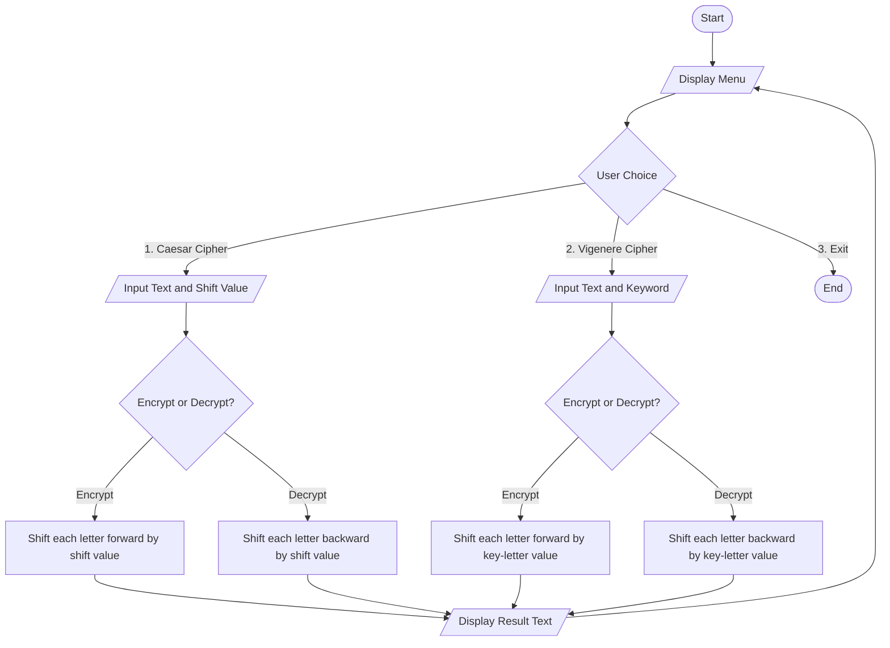

## 2. Text Encryption and Decryption Tool

### Description

A menu-driven console tool that encrypts and decrypts text using two classic substitution ciphers — the **Caesar Cipher** and the **Vigenère Cipher** — built entirely with **user-defined functions** and Python's character-code operations (`ord()`, `chr()`).

### Flowchart



### Algorithm

**A. Caesar Cipher**

1. **Start**
2. Display the menu and read the user's choice.
3. If choice = Caesar Cipher, read the input text and an integer shift value.
4. Ask whether to Encrypt or Decrypt.
5. For **Encryption**, process every character of the text:
   - If it is an uppercase letter, shift it within `A–Z` using `(ord(char) - ord('A') + shift) % 26 + ord('A')`.
   - If it is a lowercase letter, apply the same formula within `a–z`.
   - If it is not a letter (space, digit, punctuation), copy it unchanged.
6. For **Decryption**, repeat Step 5 using `-shift` in place of `shift` (this shifts every letter backward).
7. Display the resulting text.
8. Return to the menu (Step 2), and repeat until the user selects Exit.

**B. Vigenère Cipher**

1. **Start**
2. Display the menu and read the user's choice.
3. If choice = Vigenère Cipher, read the input text and an alphabetic keyword.
4. Ask whether to Encrypt or Decrypt.
5. For **Encryption**, maintain a `key_index` starting at 0. For every character of the text:
   - If it is alphabetic, compute `shift = ord(key[key_index % len(key)]) - ord('A')`, shift the character forward by `shift` positions (wrapping with `% 26`, preserving its case), then increment `key_index`.
   - If it is not alphabetic, copy it unchanged and **do not** increment `key_index`.
6. For **Decryption**, repeat Step 5 but shift each character backward by `shift` instead of forward.
7. Display the resulting text.
8. Return to the menu (Step 2), and repeat until the user selects Exit.
9. **Stop**

### Features

- Two independent cipher techniques in a single tool
- Case-preserving encryption and decryption
- Non-alphabetic characters (spaces, digits, punctuation) pass through unchanged
- Input validation for the shift value and the keyword
- Menu-driven loop until the user chooses Exit

### Sample Output

```
1. Caesar Cipher
2. Vigenere Cipher
3. Exit
Choose an option (1/2/3): 1
Enter the text: Hello World
Enter shift value (integer): 3
Encrypt or Decrypt? (E/D): E
Encrypted Text: Khoor Zruog
```

```
Choose an option (1/2/3): 2
Enter the text: Attack at Dawn
Enter keyword (letters only): LEMON
Encrypt or Decrypt? (E/D): E
Encrypted Text: Lxfopv ef Rnhr
```

---
## Author

RAJIB MALDAS

BWU/BTS/25/032
